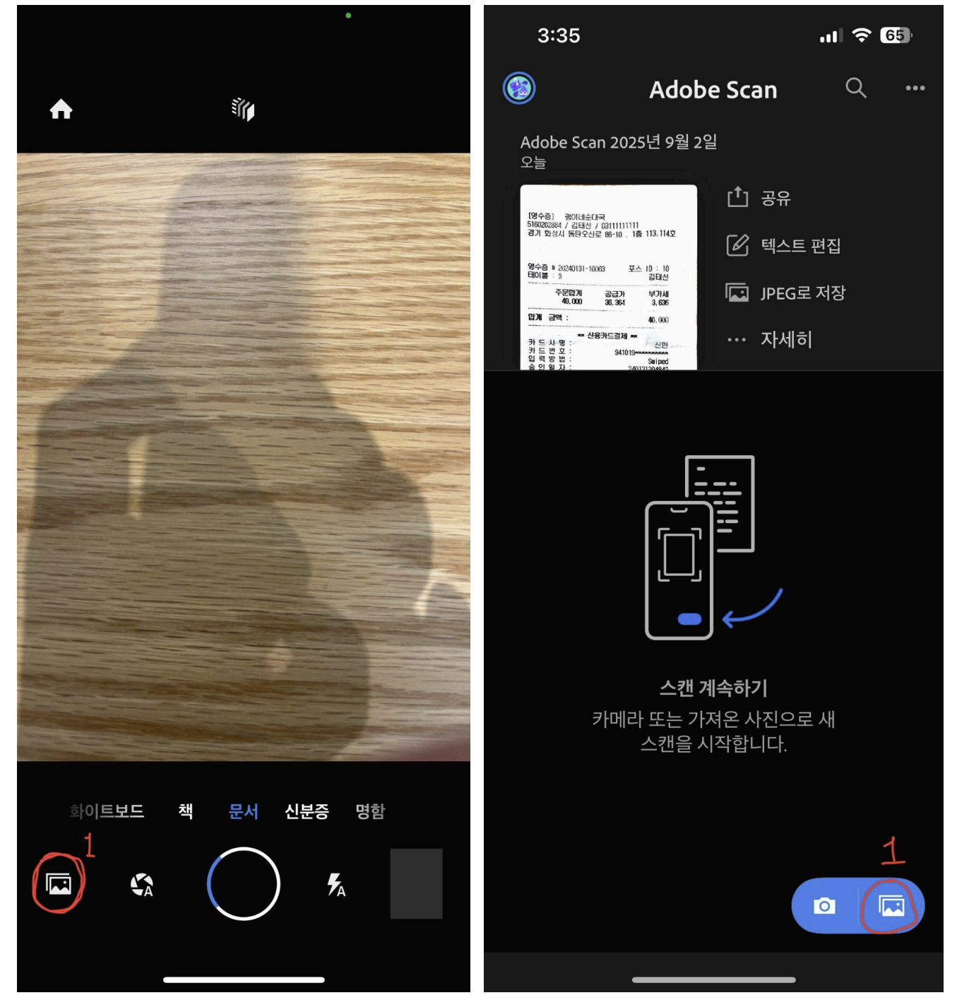

# 📖 영수증 관리 및 제출

#### 내 손안의 휴대용 스캐너 

더 이상 서류를 쌓아두거나 지갑에 영수증을 모아둘 필요가 없습니다. 모바일 디바이스를 사진 및 문서 스캐너로 활용하면 됩니다. 텍스트를 자동으로 인식하고 PDF로 만들어주는 무료 Adobe Scan 모바일 앱을 사용해 보세요. **QR 코드를 스캔하여 앱을 다운로드하세요.**

#### 1️⃣ 앱 실행 및 사진첩 접속

* Adobe Scan 앱 설치 후 실행
* 초기 화면에서 **사진첩 아이콘 클릭** 후 사진첩으로 이동

<figure><figcaption></figcaption></figure>

***

#### 2️⃣ 영수증 선택

* 한 달 동안 모은 **법인카드 영수증 전체 선택**
* 우측 상단 **체크 버튼 클릭 → 다음 단계 이동**

<figure><figcaption></figcaption></figure>

***

#### 3️⃣ 파일명 수정 및 PDF 저장

* 상단 **연필 모양 아이콘 클릭**
* 파일명을 **\[이름 + 월]** 형식으로 수정 (예: `신주혁 9월 법인카드 영수증`)
* **PDF 저장**

<figure><figcaption></figcaption></figure>

***

#### 4️⃣ 파일명 변경(추후 가능)

* 이름 변경 누락 시 → **…자세히 → 이름 변경** 메뉴로 추후 수정 가능
* 파일명에는 반드시 **이름, 날짜 기재**

<figure><figcaption></figcaption></figure>

***

#### 5️⃣ 파일 공유

* **공유 버튼 → 사본 공유** 선택

<figure><figcaption></figcaption></figure>

***

#### 6️⃣ 최종 제출

* **슬랙 DM**으로 지점장에게 공유
* 지점장은 업장 내 모든 직원 파일을 취합 후, #collab-세무-세무법인율 슬랙 채널에 매월 리마인드 되는 슬랙메시지에 영수증 제출 버튼을 클릭 후 제출합니다.
* 파일명 예시: `쇼텐 인계점 9월 영수증`

***

📌 **주의사항**

* 제출 파일은 반드시 PDF 형식으로 PDF 첨부하거나 혹은 PDF 압축해 제출
* 파일명 규칙: \[이름 + 월 + 법인카드 영수증]
* 기한 내 제출 필수(매월 1일 \~ 10일 사이 전달 영수증 제출 합니다.)
