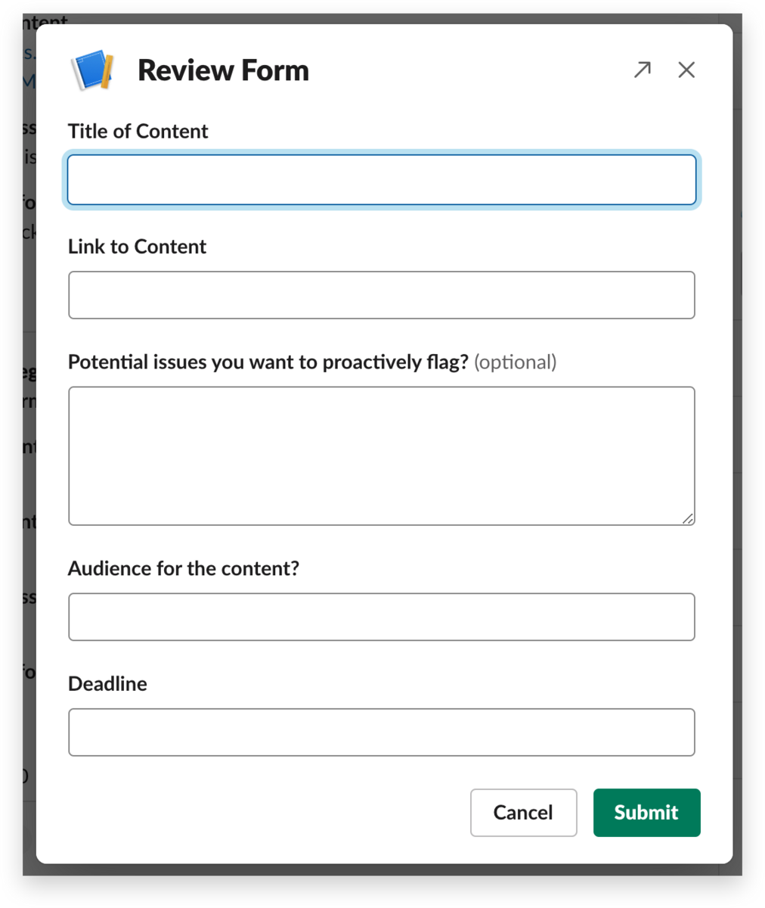

# 📖 슬랙 워크플로 이용 방법

#### **1️⃣** 목적

* **업무 효율화** : 수작업 알림·전달 → 자동화로 소요 시간 최소화
* **투명성 확보** : 요청·승인 이력 자동 기록, 책임 소재 명확화

***

#### 2️⃣ 실행 절차

| 단계    | 무엇을 하나요?                                                                                          | 화면 예시                                                                                                                                                 |
| ----- | ------------------------------------------------------------------------------------------------- | ----------------------------------------------------------------------------------------------------------------------------------------------------- |
| 호출    | 슬랙 메시지 검색창에 워크플로 이름을 입력하세요 (예: /연차신청). 또는, 각 채널에서 워크플로 LNB(좌측 내비게이션 바)를 선택하여 적절한 워크플로를 실행하시면 됩니다. | .jpeg>)                                                                                                              |
| 제출    | 팝업 폼에서 별표(\*) 필수 항목을 정확히 작성 파일·사진 첨부가 필요한 항목은 드래그 앤드롭                                             | 
<figure><figcaption></figcaption></figure>
 |
| 후속 조치 | 

본인은 메시지 스레드에서 진행 상황 확인 (승인자라면 메시지에 뜨는 Approve / Decline 버튼 클릭)
                      | 
<figure><figcaption></figcaption></figure>
                                          |

***

#### **3️⃣ 상태 확인 & 수정**

| 시나리오      | 이렇게 하세요                                                                                           |
| --------- | ------------------------------------------------------------------------------------------------- |
| 진행 단계가 궁금 | 메시지 스레드 열기 →  `View details` 링크 클릭                                                                |
| 입력 실수     | 잘못 제출한 메시지를 \[More] → Delete → 다시 `/워크플로` 실행                                                      |
| 실패 알림     | 
회색 “Workflow failed” 텍스트가 뜨면 ① 메시지 스크린샷 ② 오류 구간 설명 → <code>#ops-자동화</code> 채널에 공유
 |

